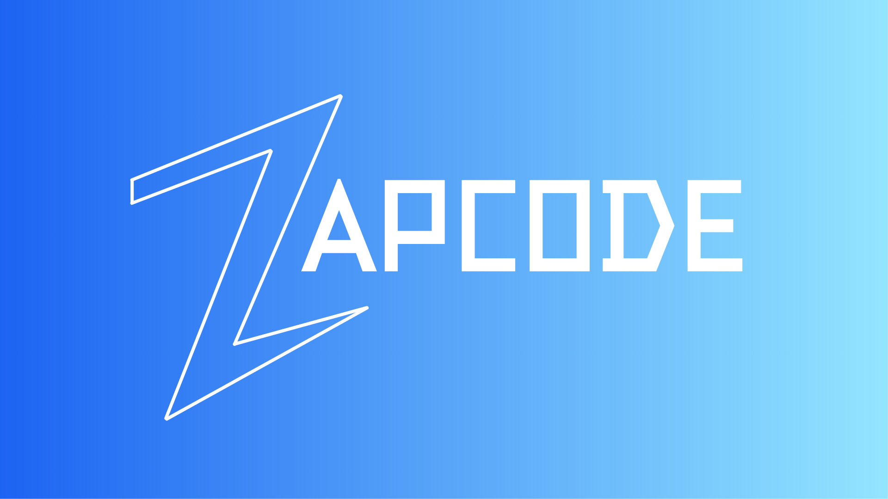

# ZapCode Figma-VSCode Bridge

<!-- Optional: Add a logo or banner here -->
<p align="center"></p>

Connect your Figma designs directly to your AI coding assistant in VS Code! This extension acts as a bridge, allowing AI tools that support the **Model Context Protocol (MCP)** to access real-time context from your selected Figma frames.

## The Problem

Modern AI coding assistants (like Cline, Cursor, etc.) running in VS Code are powerful, but they lack direct insight into your visual design process happening in Figma. Manually copying descriptions or code snippets is slow and error-prone.

## The Solution

The ZapCode Figma-VSCode Bridge solves this by creating a local connection between the **ZapCode Figma Plugin** (required companion) and your VS Code environment.

1.  You select a design element in Figma.
2.  The companion Figma Plugin prepares the context (structure, styles, assets).
3.  This VS Code extension receives the context via MCP.
4.  The extension exposes this context to compatible AI assistants using the standard **Model Context Protocol (MCP)** via a local HTTP/SSE server.
5.  Your AI assistant can then request and use this Figma context automatically when generating code, ensuring generated code more accurately reflects your design intent.

## Features

- **Real-time Connection:** Establishes a direct link between the ZapCode Figma Plugin and VS Code.
- **MCP Server:** Hosts a local SSE MCP server (`http://localhost:3001/zapcode-mcp-sse`) discoverable by compatible AI clients.
- **Figma Context Tool:** Provides the `get_figma_context` MCP tool, enabling AI assistants to request data about the currently selected Figma frame(s).
- **Status Bar Control:** Easily activate and deactivate the bridge server directly from the VS Code status bar.
- **Secure & Local:** All communication happens locally on your machine; no design data is sent to external ZapCode servers for the MCP bridge functionality.

## Requirements

- **VS Code:** Version `1.99.0` or higher.
- **ZapCode Figma Plugin:** You **must** install the companion ZapCode Figma Plugin. [[Zapcode - Figma Plugin](https://www.figma.com/community/plugin/1454956820198178710/zapcode)]
- **MCP-Compatible AI Assistant:** A VS Code extension that can act as an MCP Client over HTTP/SSE. Examples include:
  - [Cline](https://github.com/continuedev/cline) ([Cline MCP Docs](https://docs.continue.dev/reference/Model%20Context%20Protocol/overview))
  - [Cursor](https://cursor.sh/) ([Cursor MCP Docs](https://docs.cursor.sh/advanced/model-context-protocol))
  - Github Copilot **New version with agent mode**

## Setup Guide

Follow these steps to get the bridge working:

**Step 1: Install ZapCode Figma Plugin**

- Install the required companion plugin from the Figma Community.
- **Installation Link:** [[Zapcode - Figma Plugin](https://www.figma.com/community/plugin/1454956820198178710/zapcode)]

**Step 2: Install ZapCode VS Code Extension**

- Install this extension directly from the VS Code Marketplace.
  - Search for "ZapCode" in the VS Code Extensions view (`Ctrl+Shift+X` or `Cmd+Shift+X`).

**Step 3: Configure Your AI Assistant (Example: Cline)**

You need to tell your AI assistant where to find the ZapCode MCP server.

1.  Open your AI Assistant's MCP Server settings (Refer to its documentation). For **Cline**: Go to `Settings (UI)` > `MCP Servers` or edit `~/.continue/config.json`.
2.  Add a new "Remote Server" (even though it's local).
3.  Configure it with the following details:
    - **Name:** `ZapCode Figma Bridge` (or similar)
    - **URL:** `http://localhost:3001/zapcode-mcp-sse`
      _(Ensure the port `3001` and path `/zapcode-mcp-sse` match the extension's defaults. If you encounter port conflicts, this might need adjustment in the future, but stick to the default for now.)_
4.  Save the settings and ensure Cline shows the server as connected _after_ you start the ZapCode bridge in VS Code (Step 5).

    _Example Cline `config.json` entry:_

    ```json
    {
      "mcpSources": [
        {
          "title": "ZapCode Figma Bridge",
          "url": "http://localhost:3001/zapcode-mcp-sse"
        }
      ]
    }
    ```

    _(Consult your specific AI Assistant's documentation for the exact configuration method.)_

**Step 4: Configure Figma Plugin (If Needed)**

- Open the ZapCode Figma Plugin in Figma.
- Ensure any necessary setup within the plugin itself (like API keys for _other_ ZapCode features, or selecting default tech stacks) is complete. _Note: The basic MCP functionality does not require external API keys._

## Usage

1.  **Start the Bridge:** Open VS Code. Click the "Start ZapCode" item in the status bar (bottom left/right). The status bar icon should change to indicate it's active.
2.  **Open Figma Plugin:** Go to your Figma design file and run the ZapCode Figma Plugin.
3.  **Enable MCP Mode:** Inside the ZapCode Figma Plugin UI, find the "MCP Mode" toggle switch and turn it **ON**.
4.  **Confirm Connection:**
    - In the Figma Plugin UI, you should see a status indicator next to the toggle change from "Connecting..." to "✓ Connected".
5.  **Use Your AI Assistant:** Select a frame or component in Figma. Go back to VS Code and instruct your AI Assistant (e.g., Cline) to perform a task based on the design. For example:
    - _"Generate a React component based on the current Figma selection."_
    - _"Create HTML and CSS for the selected Figma frame."_
6.  **Automatic Context Fetching:** The AI Assistant, configured with the ZapCode MCP server, should automatically detect the need for Figma context and call the `get_figma_context` tool provided by this bridge extension behind the scenes.
7.  **Code Generation:** The AI assistant will receive the context (HTML structure, CSS styles, image data, assets, prompt guidance) and use it to generate more accurate code.
8.  **Stop the Bridge:** When finished, click the "ZapCode" status bar item in VS Code and select "Stop ZapCode". This closes the local servers. Remember to also toggle MCP Mode OFF in the Figma plugin if you are switching back to using its other features.
